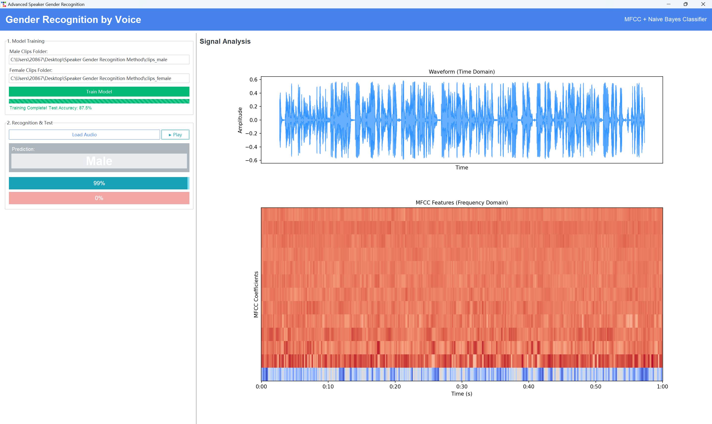

# Speaker Gender Recognition System

[](https://www.python.org/)
[](LICENSE)
[](https://ttkbootstrap.readthedocs.io/)
[](https://scikit-learn.org/)

A desktop application designed to recognize the gender of a speaker (Male/Female) based on voice audio clips. The system employs **Mel-frequency cepstral coefficients (MFCC)** for feature extraction and a **Gaussian Naive Bayes** classifier for prediction.

This project features a modern GUI that visualizes the audio signal in both the time domain (Waveform) and frequency domain (MFCC Spectrogram).

## 📸 Screenshots

| **Female Voice Detection** | **Male Voice Detection** |
|:---:|:---:|
|  |  |
| *Visualizing Waveform and MFCC Spectrogram for a female voice.* | *High confidence prediction for a male voice sample.* |

## 📂 Dataset Setup (Required)

**Note:** This repository contains the source code (`main.py`) and demo images. The audio dataset is **not included** due to size constraints.

1.  **Source**: The data is derived from the Kaggle dataset:
    👉 **[Gender Identification from Audio Dataset](https://www.kaggle.com/datasets/satyamneelmani/gender-identification-from-audio)**
2.  **Important**: This system is configured to process **.wav** files. Ensure your dataset is in WAV format.
3.  **Setup**:
    *   Prepare two folders named `clips_male` and `clips_female`.
    *   Place your **.wav** audio files into the respective folders.
    *   Place these two folders in the same directory as `main.py`.

Your folder structure should look like this:
```text
Project_Root/
├── main.py
├── Female.png
├── Male.png
├── clips_male/      <-- Put Male .wav files here
│   ├── voice_01.wav
│   └── ...
└── clips_female/    <-- Put Female .wav files here
    ├── voice_01.wav
    └── ...
```

## 🚀 Installation & Usage

### 1. Install Dependencies
Ensure you have Python installed, then run:

```bash
pip install numpy matplotlib scikit-learn librosa ttkbootstrap pygame
```

### 2. Run the Application
```bash
python main.py
```

### 3. Usage Steps
1.  **Training**: In the GUI, ensure the paths to the `clips_male` and `clips_female` folders are correct, then click **"Train Model"**. Wait for the accuracy report.
2.  **Testing**: Click **"Load Audio"** to select any **.wav** file. The system will predict the gender, display probabilities, and visualize the signal.

---

## 🧠 Algorithm & Mathematical Principles

The system processes audio signals through a standard Machine Learning pipeline: **Pre-processing $\rightarrow$ Feature Extraction $\rightarrow$ Classification**.

### 1. Pre-processing: Pre-emphasis
Before extraction, the signal is passed through a high-pass filter to amplify high frequencies. This balances the frequency spectrum since high-frequency components in human speech usually have lower energy.

**Formula:**
$$y(t) = x(t) - \alpha x(t-1)$$
*   $x(t)$: Original signal
*   $y(t)$: Filtered signal
*   $\alpha$: Pre-emphasis coefficient (typically $0.97$)

### 2. Feature Extraction: MFCC
We use **Mel-frequency Cepstral Coefficients (MFCCs)** because they model the non-linear perception of human hearing.

**The Process:**
1.  **Framing & Windowing**: Divide signal into short frames ($20\text{-}30$ms). Apply a Hamming window to reduce spectral leakage:
    $$w(n) = 0.54 - 0.46 \cos\left(\frac{2\pi n}{N-1}\right)$$
2.  **FFT (Fast Fourier Transform)**: Convert time domain to frequency domain ($|X(k)|^2$).
3.  **Mel Filter Bank**: Map the powers to the Mel scale, which approximates human pitch perception:
    $$Mel(f) = 2595 \cdot \log_{10}\left(1 + \frac{f}{700}\right)$$
4.  **Logarithm**: Take the log of the filter bank energies ($S_m$).
5.  **DCT (Discrete Cosine Transform)**: Apply DCT to obtain the MFCCs (decorrelated features):
    $$c(n) = \sum_{m=0}^{M-1} S_m \cos\left(\frac{\pi n (m - 0.5)}{M}\right)$$

We extract **13 coefficients** and calculate their **mean** across time to form a feature vector for the classifier.

### 3. Classification: Gaussian Naive Bayes
We use the **Naive Bayes** classifier. It calculates the probability of a class (Male/Female) given the features (MFCCs) using Bayes' Theorem:

$$P(y|X) = \frac{P(X|y)P(y)}{P(X)}$$

Since MFCC features are continuous, we assume they follow a **Gaussian (Normal) Distribution**:

$$P(x_i|y) = \frac{1}{\sqrt{2\pi\sigma^2_y}} \exp\left(-\frac{(x_i - \mu_y)^2}{2\sigma^2_y}\right)$$

*   $\mu_y$: Mean of feature $x_i$ for gender $y$.
*   $\sigma^2_y$: Variance of feature $x_i$ for gender $y$.

---

## 🔄 Algorithm Flowchart
graph TD
    A([Start]) --> B[Load Audio Dataset]
    B --> C{For Each File}
    C -->|Read .wav| D[Pre-emphasis Filter]
    D --> E[Framing & Windowing]
    E --> F[FFT & Mel Filtering]
    F --> G[DCT (Get MFCC)]
    G --> H[Calculate Mean Vector]
    H --> I[Train Naive Bayes Model]
    
    I --> J([Model Ready])
    
    K[User Uploads New Audio] --> L[Feature Extraction (Same steps as above)]
    L --> M[Input to Classifier]
    J --> M
    M --> N{Compare Probabilities}
    N -->|P(Male) > P(Female)| O[Output: Male]
    N -->|P(Female) > P(Male)| P[Output: Female]
    O --> Q[Update GUI & Plot Graphs]
    P --> Q


## 📄 License

This project is open-source. Feel free to use and modify it.

